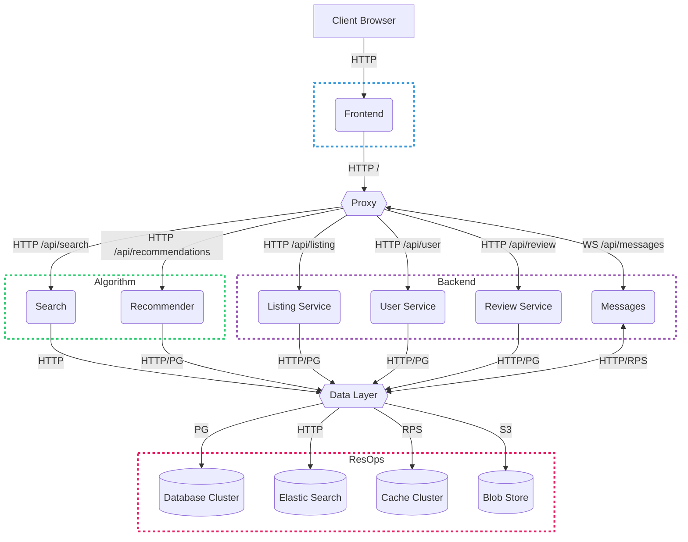

# UVic MartletPlace

## Local Development

> [!NOTE]
> **BEFORE** you run the following steps make sure you have [`docker`](https://docs.docker.com/engine/install/) & the [`docker compose`](https://docs.docker.com/compose/install/#scenario-two-install-the-compose-plugin) plugin installed and running

```shell
# Clone the repository
git clone https://github.com/UVicMartletplace/martletplace && cd martletplace

# To start developing, run the docker compose stack
docker compose up --build
```

### Testing

Testing will run on each commit as part of each service's workflow.
To manually test, run the test.sh file in the root of the project. This will run all tests for all services sequentially.

The development environment is now running and accesible at [http://local.martletplace.ca/](http://local.martletplace.ca/)

## System Architecture


